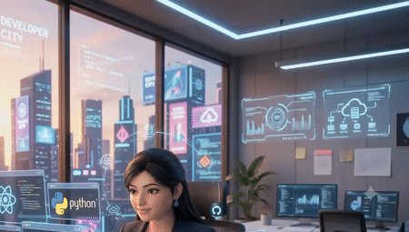

 

  

  

---

---

# 🚀 Engineering Snapshot

| 🏆 Achievements | 📄 Research | 💼 Experience | 🚀 Projects | 📊 ML Accuracy |
| :-------------: | :---------: | :-----------: | :---------: | :------------: |
|        3+       |   Elsevier  | 2 Internships |      5+     |     93.78%     |

---

# 👩‍💻 About Me

  

  

<table>
<tr>
<td align="center" width="33%">

### AI Builder

Machine Learning  
Computer Vision  
LLM Applications  
Prompt Engineering  

</td>
<td align="center" width="33%">

### Backend Engineer

REST APIs  
Django / FastAPI  
System Design  
Databases  

</td>
<td align="center" width="33%">

### Product Developer

Full Stack Apps  
SaaS Projects  
Hackathon Builds  
Real-World Solutions  

</td>
</tr>
</table>

 

  

# ⚡ Engineering Arsenal

  

# 🌟 Featured Projects

<table>
<tr>
<td width="50%">

## 🤟 SignSetu

AI-powered bidirectional sign language translation platform for real-time communication.

🏆 **Winner — UHack 4.0**  
📊 **91%+ Gesture Recognition Accuracy**  
📚 **5000+ Custom ISL Dataset**  
⚡ **Real-Time Sign-to-Text**  
🔊 **Sign-to-Speech**  
🤖 **Text-to-Sign Avatar**

**Tech:** Python • TensorFlow • OpenCV • MediaPipe • React • Flask • Firebase • Docker

</td>
<td width="50%">

## 🕉️ Hanuman Pushpavarsha

Production-grade community website for event, donation, and member management.

🌐 **Bilingual Website**  
💳 **Payment Gateway**  
📺 **Live Streaming**  
🔐 **Role-Based Authentication**  
📊 **Admin Dashboard**  
🚀 **Deployed on Vercel**

**Tech:** Next.js • Firebase • Vercel

</td>
</tr>

<tr>
<td width="50%">

## 🤖 QuickSeva

LLM-powered civic services assistant for government scheme discovery.

🏆 **Winner — Google Build with AI**  
🧠 **Gemini Powered**  
⚡ **Conversational AI**  
🏛 **Government Scheme Assistant**  
🌐 **Citizen Support Platform**

**Tech:** Python • React • Gemini API • Firebase • Prompt Engineering

</td>
<td width="50%">

## 🧘 Aarogyam

Mental wellness platform with personalized therapy modules and Firebase backend.

👥 **100+ Users**  
🧠 **Personalized Wellness Modules**  
🔐 **Firebase Authentication**  
📱 **Responsive UI**  
🌱 **Wellness-Focused Ecosystem**

**Tech:** JavaScript • Firebase • REST APIs

</td>
</tr>
</table>

# 📄 Research Publication

### Multi-Class Anomaly Detection in Network Traffic Using Supervised Machine Learning

* 175,000+ Network Records Analyzed
* Intrusion Detection System Research
* XGBoost Accuracy: 93.78%
* Ensemble Models Outperformed Linear Models
* International Conference Presentation
* CIC UNSW-NB15 Dataset

---

# 🏆 Achievements

* 🥇 Winner — UHack 4.0
* 🏆 Winner — Google Build with AI
* 🥇 Top 10 Finalist — NSUT National Hackathon
* 📄 Elsevier Published Researcher
* 🎤 Lead Organizer — HackDiwas 3.0
* 💼 Backend Development Intern — Prodesk IT
* 💻 Web Developer Intern — Code Resite
* 🚀 Freelance Full Stack Developer

# 🌍 Community & Leadership

# 📊 GitHub Analytics

  

# 💡 Random Dev Quote

# 💭 Engineering Philosophy

<table>
<tr>
<td align="center" width="33%">

### 🧠 Think

Break complex problems into simple, scalable systems.

</td>
<td align="center" width="33%">

### ⚙️ Build

Turn ideas into AI-powered products and production-ready applications.

</td>
<td align="center" width="33%">

### 🚀 Ship

Learn fast, iterate faster, and create technology that makes impact.

</td>
</tr>
</table>

 

<table>
<tr>
<td align="center">

 

  

<h2>✨ Thanks for visiting my profile! ✨</h2>

I’m always excited to connect with amazing people, collaborate on meaningful projects,  
and build solutions that create real-world impact.

 

  

 

<h3>Made with ❤️ by Saumya Agrahari</h3>

</td>
</tr>
</table>

